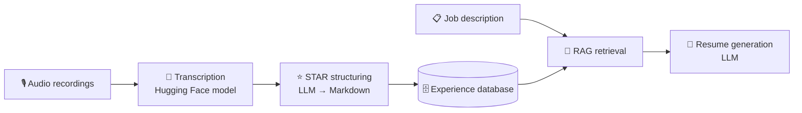

# Resume.ai

> Talk about your career. Get a resume tailored to the job.

Resume.ai is an AI tool that builds a tailored resume for any job description. Instead of starting from a blank document, you **record yourself talking about your past experiences**. The tool transcribes those recordings, organizes them with the STAR method, and uses RAG to choose the experiences most relevant to the role you're applying for.

This project is part of my learning journey through the AI Engineer core course by Donner. I'm building it in public, so expect frequent changes.

---

## How it works

1. **Record:** I record audio files describing my previous experiences in my own words.
2. **Transcribe:** A Hugging Face speech-to-text model converts the audio into text.
3. **Structure:** A second model turns each transcript into Markdown, splitting the experiences into topics that follow the **STAR** method:
   - **S**ituation: the context
   - **T**ask: what needed to be done
   - **A**ction: what I did
   - **R**esult: the outcome and impact
4. **Store:** The structured topics are stored in a database that serves as the knowledge base for a RAG pipeline.
5. **Retrieve & Generate:** Given a job description, the RAG pipeline retrieves the most relevant experiences and passes them as context to an LLM, which writes the tailored resume.

---

## Tech stack

| Layer | Tools |
| --- | --- |
| Transcription | Hugging Face speech-to-text model |
| Structuring & generation | LLMs orchestrated with LangChain |
| Retrieval | RAG over a database of STAR-structured experiences |
| Front-end | _Planned_ |

_The stack will be finalized as the project evolves._

---

## Roadmap

- [ ] Audio transcription with a Hugging Face model
- [ ] Transcript → STAR-structured Markdown
- [ ] Storage of experiences in a database
- [ ] RAG pipeline for retrieving relevant experiences
- [ ] Resume generation from a job description
- [ ] Front-end interface

---

## Getting started

🚧 Setup instructions will be added once the first components are working.

---

## Follow the journey

I'm documenting the progress in a LinkedIn series called **Resume.ai**. Follow along to see how it develops.

<!-- Add your LinkedIn profile link here -->